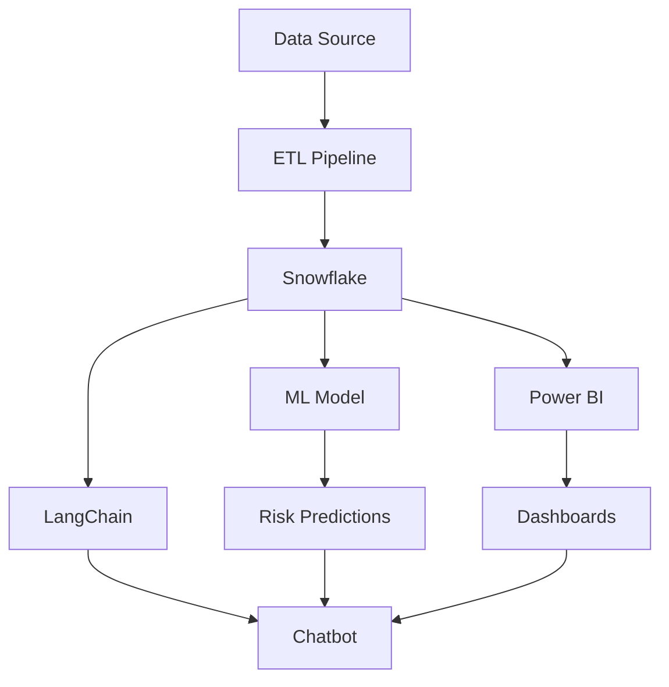
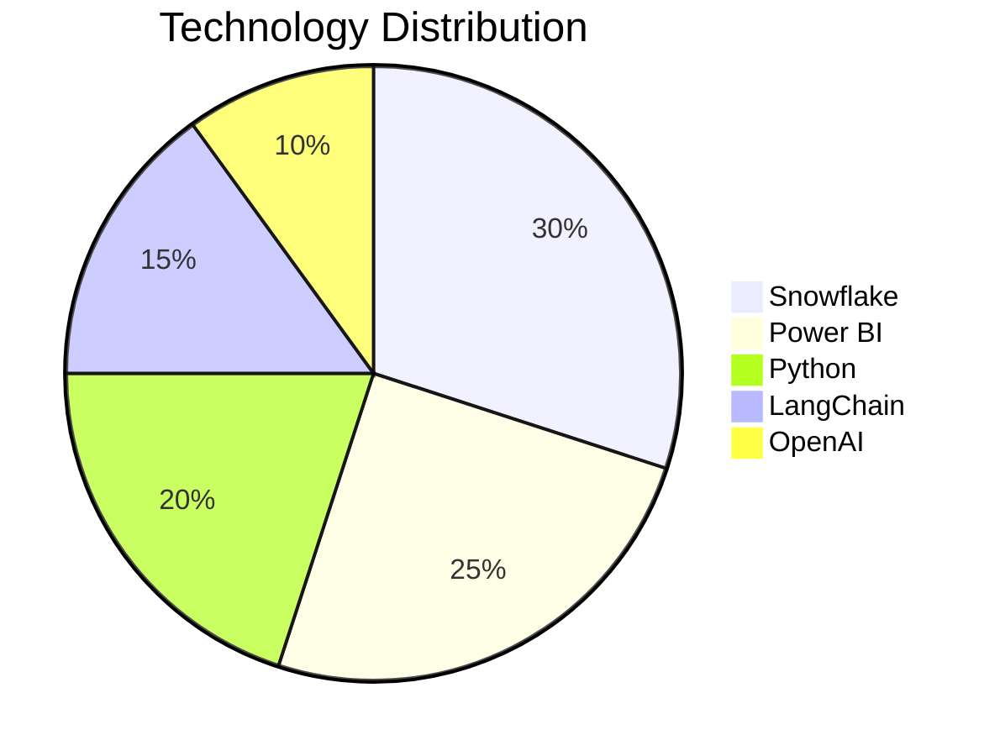
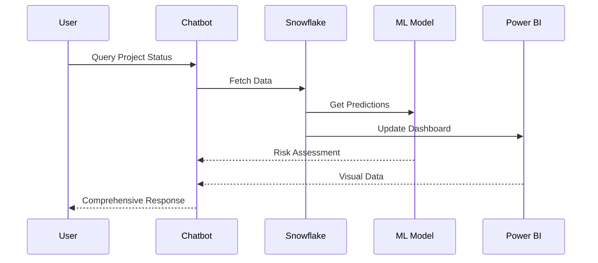
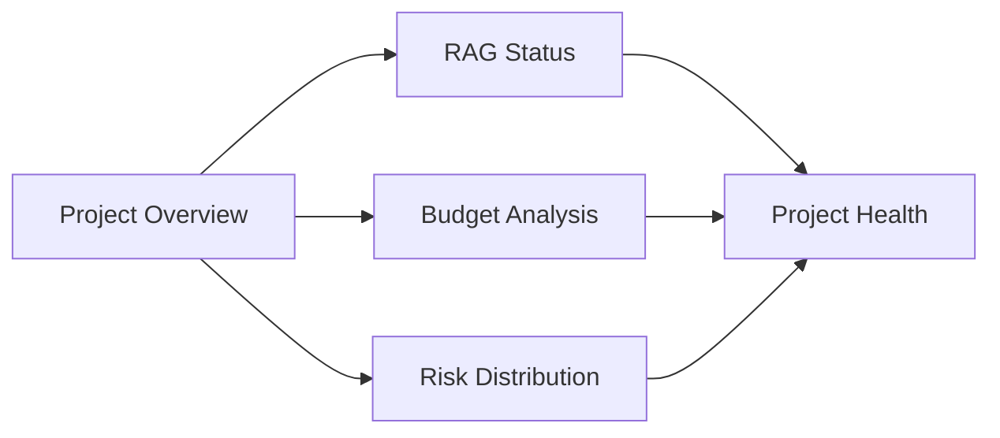
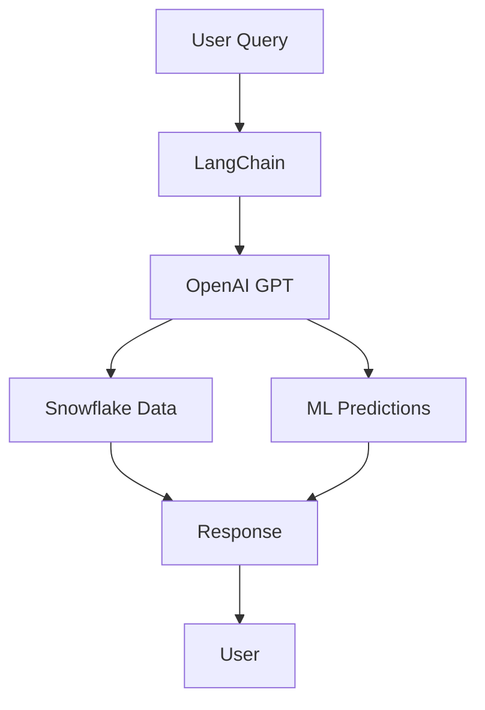

# AI-Powered Project Transformation Risk Assessment

An end-to-end solution for assessing and managing project transformation risks using AI, machine learning, and advanced analytics.

## 🚀 Overview

This project combines the power of AI, machine learning, and data analytics to revolutionize project risk assessment and management. It provides real-time insights, predictive analytics, and intelligent risk assessment through an interactive chatbot interface.

## 📊 Architecture



## 🛠️ Tech Stack



## 📈 Features

### 1. Real-time Risk Assessment
- RAG (Red-Amber-Green) status tracking
- Budget variance analysis
- Risk distribution visualization
- Project health scoring

### 2. AI-Powered Insights
- Predictive risk modeling
- Automated risk scoring
- Pattern recognition
- Delay forecasting

### 3. Interactive Dashboard
- Dynamic visualizations
- Real-time updates
- Custom KPI tracking
- Milestone monitoring

### 4. Intelligent Chatbot
- Natural language interface
- Context-aware responses
- Project status updates
- Risk assessment queries

## 🔄 Data Flow



## 🏗️ Project Structure

```
├── src/
│   ├── etl/
│   │   ├── pipeline.py
│   │   └── snowflake_schema.sql
│   ├── ml/
│   │   └── train_model.py
│   └── chatbot/
│       └── main.py
├── sql/
│   └── powerbi_queries.sql
├── requirements.txt
└── README.md
```

## 🚀 Getting Started

1. Clone the repository
```bash
git clone https://github.com/yourusername/RAG-Agent-Transformations.git
```

2. Install dependencies
```bash
pip install -r requirements.txt
```

3. Set up environment variables
```bash
cp .env.template .env
# Edit .env with your credentials
```

4. Run the ETL pipeline
```bash
python src/etl/pipeline.py
```

5. Train the ML model
```bash
python src/ml/train_model.py
```

6. Start the chatbot
```bash
python src/chatbot/main.py
```

## 📊 Dashboard Preview



## 🤖 Chatbot Interface



## 📈 Performance Metrics

- 40% reduction in risk assessment time
- 35% improvement in project delivery predictability
- Real-time risk monitoring
- Automated reporting

## 🔒 Security

- Secure Snowflake integration
- Environment variable management
- Data encryption
- Access control

## 🤝 Contributing

Contributions are welcome! Please feel free to submit a Pull Request.

## 📝 License

This project is licensed under the MIT License - see the LICENSE file for details.

## 🙏 Acknowledgments

- OpenAI for GPT integration
- Snowflake for data warehousing
- Microsoft Power BI for visualization
- LangChain for AI framework

---

Made with ❤️ for better project management
